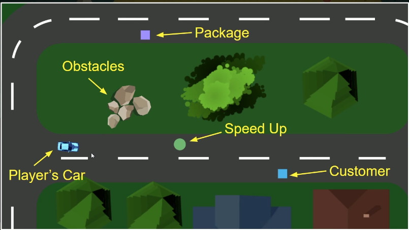

# Delivery Driver Game

## Description

This is a game where you play as a delivery driver. You have to deliver packages to the correct houses in the correct order. You have to be quick and efficient to get the best score.

## Game design

### Game mechanics

Drive over pickups

* Drive the car forwards and backwards
* Turn the car left and right
* Increase speed up when drive over `speed ups`
* Decrease speed when drive over `slow downs`
* Pick up `packages` when drive over them
* Deliver `packages` when drive over delivery spot
* Change car color to show status

### Player Experience

* Relaxing

### Game loop

## Controls

* `W` or `up arrow` - Move forward
* `S` or `down arrow` - Move backward
* `A` or `left arrow` - Turn left
* `D` or `right arrow` - Turn right

Find and deliver all the packages to win

## Development steps

[Developing The car/Driver](./the_car.md)

## Credits and copyrigth

**This is only a sumary of the course from [GameDev.tv](https://www.gamedev.tv/) at udemy plataform [UnityComplete C# Unity Game Developer 2D](https://www.udemy.com/course/unitycourse)
all rights reserved to them.**

- [GameDev.tv](https://www.gamedev.tv/)
- [UnityComplete C# Unity Game Developer 2D](https://www.udemy.com/course/unitycourse)
